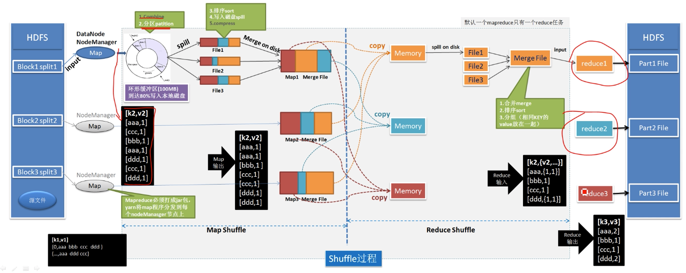

# 离线计算框架 MapReduce
分而治之的思想
## 流程
- 分割
- 将分割文件分发到每个机器上
- 每个机器进行运算
- 收集运算数据结果
- 合并

### map 阶段
并行处理输入数据, 映射成数据对象, 格式发生变化

### reduce 阶段
对 map 结果进行合并

### shuffle连接 map 和 reduce 两个阶段
- map shuffle
- reduce shuffle

## 流程示意图

- map阶段

> 输入[a,b,a,c,a]
-  map 阶段输入的一大块数据仍然太大不能再内存中进行处理, map shuffle 相当于是对map 阶段输入的一大块数据进行了分区, 压缩, 内部排序, 外部排序, 最后输出一大块排序好的数据
  
> 输入[a,1] [b,1] [a,1] [c,1] [a,1]
> 输出[a,1] [a,1] [a,1] [b,1] [c,1]

- reduce shuffle相当于对 map shuffle 之后的数据块进行归并, 因为已经排好序了, 所以相同类别的可以放在一个 reduce 中

> [a,1] [a,1] [a,1] [b,1] [c,1]
> 输出[a,1,1,1] [b,1] [c,1]

- reduce 输出
> [a,3] [b,1] [c,1] [d,2]

## 特性
- 仅仅适用于离线处理, 具有很好的容错率和扩展性
- 适合简单的批处理任务

- 缺点明星, 开销太大, 过多使用磁盘使得效率太低