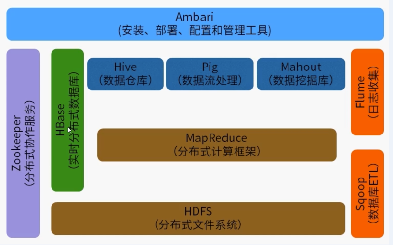

# hadoop 

## 什么是 hadoop
是一个用于分布式大数据处理的编程框架, 大数据处理的完整生态系统, 包括 HBase, Hive, Pig, Spark, ZooKeeper 等等
- 开源的
- 可靠的
- 可扩展的
- 分布式计算

## 应用场景
单机处理数据的耗时太久了, 每个机器负责一部分, 最后把结果汇总, 其中可能遇到的问题是:
- 如何分配
- 有的文件大, 有的小
- 有的机器好, 有的差
- 不能同时完成, 闲置资源浪费
- 汇总起来的时候网络波动引起数据的丢失和覆盖
- 机器出了问题, 如何重新分配...

hadoop 提供了一整套的解决方案
- map 方法写分配的逻辑
- reduce 写合并结果的逻辑

## 核心项目
**HDFS**: hadoop distributed file system, 分布式文件系统
MapReduce: 并行计算框架
yarn: 资源管理
### HDFS
- 主从结构
    - 主节点: namenode
    - 从节点: datanode
- namenode: 管理
    - 接受用户操作请求, 对文件系统的操作( mkdir, put, text...), 命令行和Java Api 方式
    - 维护文件系统的目录结构(用来对文件进行分类管理)
    - 管理文件和 block 之间的关系(文件被分为 block), block 和 datanode 之间的关系
- datanode: 存储
    - 存储文件
    - 将文件分成 block( 默认128m), 将大数据分成相对小的 block 块, 充分利用磁盘空间, 方便管理
    - 大文件会被分成很多以块为大小的分块进行存储, 如果文件 小于 HDFS , 那么文件的存储不会占用整个块的空间, 只是自己的空间
    - 副本管理, 存储在不同 datanode 上
- mapreduce
    - 主从架构
        - 主节点: jobTracker
        - 从节点: TaskTraker
    - jobTracker
        - 接收客户的计算任务
        - 分给 taskTracker 执行
        - 监控 taskTracker 执行情况
    - taskTracker
        - 执行任务
## 解决的问题
- 海量数据的存储 
    - HDFS
    - 存储海量数据
    - 动态添加机器
    - 备份三份, 当数据文件损坏, 快速恢复
- 海量数据的分析
    - mapreduce
    - 核心理念:分而治之
- 集群资源的管理和任务调度
    - yarn
    - 资源管理( cpu, 内存)
    - 任务调度

## 特点
- 扩容能力
- 成本低
- 高效率
- 可靠性

## 背景
三大论文
- GFS - HDFS
- mapreduce
- bigtable - HBASE

## 应用场景
- 日志分析
- 推荐系统
- GPS 数据分析推送

## hadoop 生态圈

