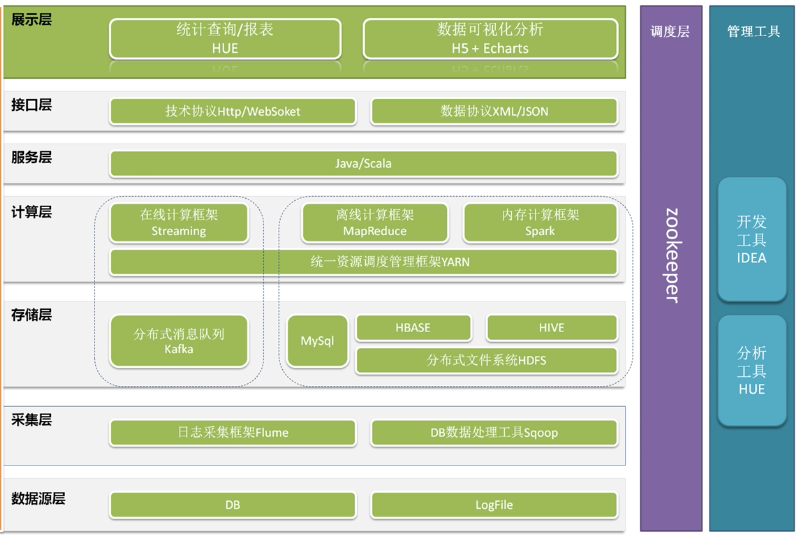
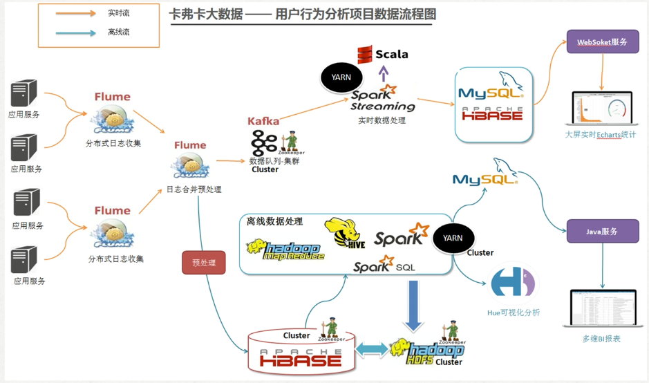

# 新闻网用户的日志分析系统
## 业务需求
- 捕获用户浏览日志信息( TB)
- 实时分析前20名流量最高的新闻话题
- 实时统计当前线上已曝光的新闻话题
- 统计哪个时段用户浏览量最高
- 报表

## 系统架构

## 流程设计

## 集群资源规划设计

## 高可用性架构

### resourcemanager HA
| vm1 | vm2 | vm3|
| - | - | - |
| resourcemanager | resourcemanager | nodemanager
| nodemanager | nodemanager | 

### HDFS HA
| vm1 | vm2 | vm3 |
|-|-|-|
|namenode | namenode | |
datanode | datanode | datanode |
journalnode | journalnode | journalnode |
zkfc | zkfc

## 结构功能
- zkfc : 是一个新的组件，它是一个ZooKeeper客户端，它还监视和管理NameNode的状态。运行NameNode的每台机器也运行ZKFC，他们之间是一对一的关, 对每个 namenode进行健康监测, 故障自动转移
- 