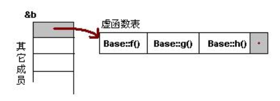
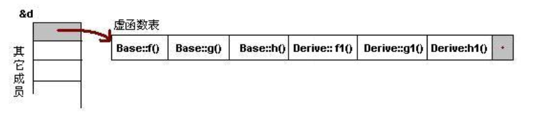
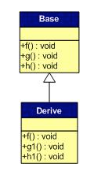
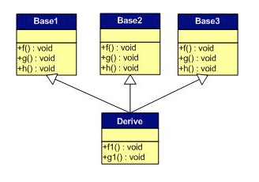
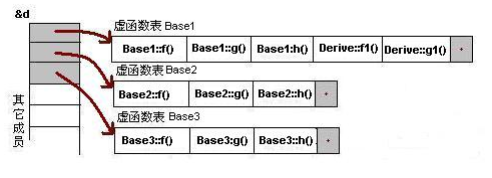

# 多态 虚函数 纯虚函数 虚函数表

## 多态性和非多态
一个接口,多种方法.程序在运行时才确定调用的函数,是 oop 的核心概念.

- 多态性通过**虚函数**来实现,子类可以重新定义父类(重写:override).
>重写有两种,一种是重写虚函数(体现多态),另一种就是重写成员函数(并没有体现)

>和重写相对的另一个概念是重载(overloading),指的是多个重名的函数他们的参数列表不同(个数,类型),编译器通过函数的调用参数列表来决定调用的
- 多态和非多态的本质区别在于:**早绑定和晚绑定**.函数调用的地址是编译期间就能确定的,那就是非多态;需要在运行的时候才确定,那就是多态
- 面向对象三大特性
      1. 封装:模块化代码,实现代码重用
       2. 继承扩展已经实现的代码,实现代码重用
       3. 多态: 实现接口重用,同一个接口可以自适应到各自对象的实现方法上面去.
- 实现多态的方法
      1. 声明基类指针,指向一个子类对象
      2. 调用虚函数
      3. 如果没有多态性,则调用的函数将一直是基类的相应函数,即,函数调用的地址是固定的,不能实现一个接口,多种方法.
## 多态举例
```cpp
#include<iostream>  
using namespace std;  
  
class A  
{  
public:  
    void foo()  
    {  
        printf("1\n");  
    }  
    virtual void fun()  
    {  
        printf("2\n");  
    }  
};  
class B : public A  
{  
public:  
    void foo()  
    {  
        printf("3\n");  
    }  
    void fun()  
    {  
        printf("4\n");  
    }  
};  
int main(void)  
{  
    A a;  
    B b;  
    A *p = &a;  
    p->foo();  
    p->fun();  
    p = &b;  
    p->foo();  
    p->fun();  
    return 0;  
}  
```
输出为
```
1 2 1 4
```
对于输出`1 2`是没有问题的,在第三和第四个输出的时候,因为基类指针指向了子类,而`foo()`函数没有被虚拟化,所以,这是一个早绑定,只能调用基类的同名函数,`fun()`是一个基类中的虚函数,所以可以被晚绑定,调用子类中的函数,从而实现了**一个借口,多个函数**的多态性.
- 小结
    - 如果有 virtual 才有多态(覆盖基类函数)
    - 没有多态,按照原类型调用(隐藏)


## 纯虚函数
在基类中定义的虚函数,没有定义,派生类需要定义自己的实现方法.
```cpp
virtual void function() = 0;
```
派生类中必须进行重写以实现多态性. 含有纯虚函数的类成为抽象类,不能生成对象.

- 编译多态性: 通过重载实现
- 运行多态性: 通过虚函数实现(覆盖)


## 虚函数表(vtable)
虚函数是通过虚函数表来实现的,这个表主要是一个类虚函数的地址表,这张表解决了继承和多态的问题,保证了真实反映和使用实际的函数.这个表在一个对象实例的最前面,我们可以通过变量虚函数表的函数指针,调用相应的函数.
```cpp
class Base {
     public:
            virtual void f() { cout << "Base::f" << endl; }

            virtual void g() { cout << "Base::g" << endl; }

            virtual void h() { cout << "Base::h" << endl; }
};
Base b;
```
这个对象实例`b`的结构如下:
<div align=center>
</div>

## 继承的几种情况
1. 一对一继承(子类没有覆盖重写虚函数,这样在实际中没有意义,仅为对比)
如果子类也有自己的虚函数,并继承父类的虚函数表,则其虚函数表的结构为:
<div align=center>
</div>

总结:
- 虚函数按照声明顺序放在表中
- 父类的虚函数放在子类的前面


2. 一对一继承(有虚函数被覆盖)
父子两个对象的表分别如下:

<div align=center>
</div>

则最后子类的虚函数表将为:
<div align=center>
</div>

总结:
- 覆盖的虚函数,父类位置被子类顶替
- 其余顺序不变
因此,如果有
```cpp
Base *b = new Derive();
b->f();
```
该父类对象指向的地址是子类的地址,对象`b`将调用覆盖后的 `Derive::f()`.
这就是多态实现的原理.

3. 多重继承(无覆盖)
如果子类对父类的虚函数没有覆盖:
<div align=center>
</div>

那么子类实例中的虚函数表是这样子的:

<div align=center>
</div>

总结:
- 每个父类有自己的虚表
- 子类的虚函数在第一个父类之后
- 父类顺序是按照声明顺序来的
当每次设计到这些虚函数的时候,需要对应到相应的虚函数表(根据基类的定义),比如:
```cpp
Base2 *ptr = new d();
ptr->f()  //调用第二个表的第一个函数(Base2 的 f())
```

4. 多重继承(有虚函数覆盖)
<div align=center>
</div>
所有相应的同名虚函数都要被覆盖:
<div align=center>
</div>


## 安全性
- 子类中没有重载的虚函数虽然出现在第一个虚函数表中,但是相应的父类指针并不能访问这个函数.程序将报错.但是仍然可以通过地址访问的方式调用.
- 对于父类中`private`的方法,如果是虚函数,并被子类通过共有继承,那么这个函数将出现在子类的虚函数表中,并可以通过地址访问的方式被调用,这是很危险的.
- 内联函数不能定义为`virtual`,因为需要在编译阶段展开,而虚函数是晚绑定的.
- 静态成员函数也不能定义为`virtual`,因为它属于整个类.
- 构造函数不能是`virtual`,但是析构可以
- 析构函数最好定义为`virtual`,因为每个子类的析构需求不同,调用父类的析构函数可能会处理不干净.

>虚函数除了实现多态性之外,还能在设计上有封装和抽象的功能(抽象工厂)
>除了指针之外,引用也可以事先多态
```cpp
　　Class A; Class B : public A{…};
　　B b; A& ref = b;
```
