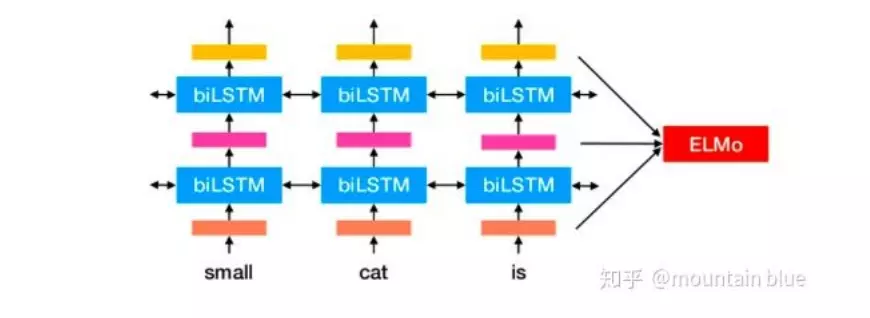

# 一种新型的,基于上下文的词嵌入犯法: ELMo
来自论文Deep contextualized word representations, 2018年发表
## 背景
作者认为, 好的词向量表征应该兼顾两个问题, 
1. 词语用法在语义上和语法上的复杂特点
2. 随着语言环境和上下文的改变,这些用法也应该随之改变
 
ELMo 算法的特点是, 每个词语的表征都是整个输入语句的函数,具体做法就是现在大语料上用 language model 来训练处 bi-LSTM 模型,然后利用 LSTM 产生词语的表征. 同时可以采用迁移学习, 在下游任务的应用中,忽略监督标签,利用语料来做 LM 的微调, 相当于一种 domain transfer; 然后利用 label 的信息进行 supervised learning.
## 步骤
1. 产生 pretrained biLM 模型, 由两层 bi-LSTM 组成,图如下:

2. 做一个 transfer learning, 根据任务中提供的语料
3. 使用 ELMo 中的 word embedding 进行对人物的训练, 这样既不失一般性, 又有一定的针对性, 而且还能通过语言模型的引入增强上下文不同语境中对单词的理解

## 总结
- ELMo 在很多 NLP 夏有任务中表现非常优异, 和之前的很多通用编码器相比, 为了解决多义性词汇的问题, 其他模型野心太大, 直接提供了句向量的一站式编码方案, 下游任务没有自主权, 仅仅只能训练一个句向量的分类器, 不能对特定任务有特定的模型选择,
- ELMo 不是通过直接对句子编码, 而是仅仅提供了 word embedding
层面的解决方案, 具体的模型由下游任务中具体任务自己选择, word embedding表意的丰富性加持了下游特定模型的强大能力, 所以才有这样很好的效果
