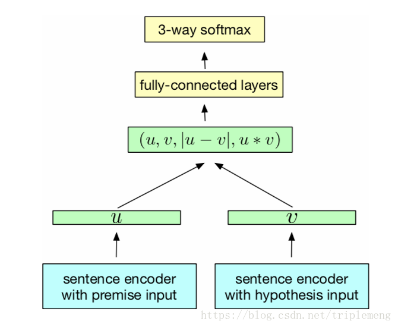

# inferSent
这是2017年影响力非常大的一篇文章, Supervised Learning of Universal Sentence Representation from Natural Language Inference Data, 论文提出的通用编码器在 NLP 很多任务上都能去的 state of art 的成绩

## 背景
根据学习方法, 句子编码可以分成两类, 无监督学习和监督学习, 无监督学习泛化能力强, 监督学习对当前任务的效果更好, 那么能不能通过 CV 中迁移学习的思想, 引入一个基于监督学习的, 有较强泛化能力的编码器呢?
作者在论文中回答了两个问题
### 什么是 NLP 中的 ImageNet?
我们希望有监督学习带来的精确, 也想要通过迁移带来类似无监督的泛化能力, 这对于数据集监督学习的问题有很高要求, 需要一个能"理解语义"的数据集和任务, 需要有普遍性, 至少在迁移之后, 需要有分类(classification), 包含(entailment), 相似度(similarity)三种不同任务上好的表现
### 什么是 NLP 中的 LeNet(VGG,RES,etc)
我们的目的最后还是找到一个通用的编码器

## 答案
### NLP 的 ImageNet
SNLI 是这个我们需要找的数据集, Stanford Natural Language Inference Corpus, 这是一个分类数据集, 一共有570k 个人造句子对组成, 每对句子将被分成三类(entailment, contradiction, neutral) 
选择 SNLI 的原因是:
-  这个任务足够具体, 好的模型需要对语义有足够的理解, 从而区分句子对的分类; 
-  同时有足够一般化, 避免产生一般意义上的 task-specific 的特征, 如情感分类, 一些表达情感的词语在情感分类中, 会有很大的权重, 比如 fucking , god 之类的情绪词, 在 tansfer 到其他任务中的时候, 这样的特征不够一般;
### 编码器的对比和设计

句子编码器的基本结构, 同时也是 SNLI 数据集任务的解决方法大概如上图
- Bi-LSTM包括了两个方向上的信息, 一般好于 LSTM/GRU
- CNN 潜在抓取 local 信息, 但是对于全局语义往往不能有一个足够一般的概括, 所以往往不如 LSTM 类的模型
- attention 机制能很好地在抓取 local 信息, 补充 RNN 类结构的抓重点能力, 但是在一种任务中找到的 local 信息往往不能很好地迁移到其他任务上, 所以 attention 有过拟合的嫌疑
- 综上所述, bi-LSTM 是最好的模型

## 实验和结果
### 实验
12个不同的 NLP 任务被引入测试以检验这个编码器的泛化能力, 分别是
- Binary and multi-class classification 包括 sentiment analysis (MR, SST)， 
- question-type(TREC)，product reviews(CR)， subjectivity/objectivity(SUBJ) 以及 opinion polarity(MPQA)。 
- Entailment and semantic relatedness 使用了SICK数据，其中SICK-E用来做entailment，SICK-R做semantic relatedness(语义相关)。 
- STS14 - Semantic Textual Similarity包括了SemEval里的STS14。 
- Paraphrase detection使用Microsoft Research Paraphrase Corpus。 
- Caption-Image retrieval用到了COCO数据集。
 
大概就是三类任务, 分类问题, 相关性问题, 排序问题

### 结果
 Bi-LSTM - max pool 是最好的编码器, 泛化能力好于其他

 ## 总结
 这篇论文在实际中的意义在于, 给缺少训练样本的学习任务一个比较强大的 baseline, 只要在这个 baseline 基础上加以训练, 稍作修改就能得到自己的模型, 另外这也是一个不错的和其他模型对比的基准线.
