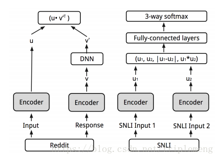

# 从多任务对话中学习句向量编码器
来自论文Learning Semantic Textual Similarity from Conversations 
## 论文思路
作者认为, 词向量本身并不能很好地综合出一个句向量的真正语义, 比如"how old are you"和"what is your age"没有一个词是相同的, 在不能保证词向量编码质量的情况下, 我们不能奢求传统非监督学习后两个句向量非常相似. 但是, 这两个问题的回答是相似的,比如"I am 20 years old". 相反,"How are you"和"how old are you"的回答完全不一致, 因此即使他们的用词非常相似,也不能做出一致性判断.思路就是可以从问题回答对作为监督学习的数据集进行编码器的构造.
## 模型结构
除了从回答中学习编码器之外,作者还认为多任务学习同一个编码器能够提供更多的信息,增强模型的泛化能力,因此,两个模型定义如下:

- 第一个模型是从对话中学习,模型是不对称的,注意这个模型是不对称的,为了区分开问题和回答(不让他们完全相似),一系列操作之后做点积计算相似度
- 第二个模型是 infersent,encoder 和第一个模型中共享,通过两个任务的学习,得到最后的编码器
- encoder 中,作者采用了 transformer 结构
## 总结
作者认为, 加入多任务学习后,模型能学习到更好的语义表征,因为这能够覆盖到更多的语义现象,在单任务中这是不能学习到的. 这仍然是一种"质量不够,数量来凑"的一种"民主"决策的体现.在之后的实验对比中,模型的表现强于单纯的 infersent, 作者推测问答对话起到了正则化的作用,避免了过拟合 SNLI