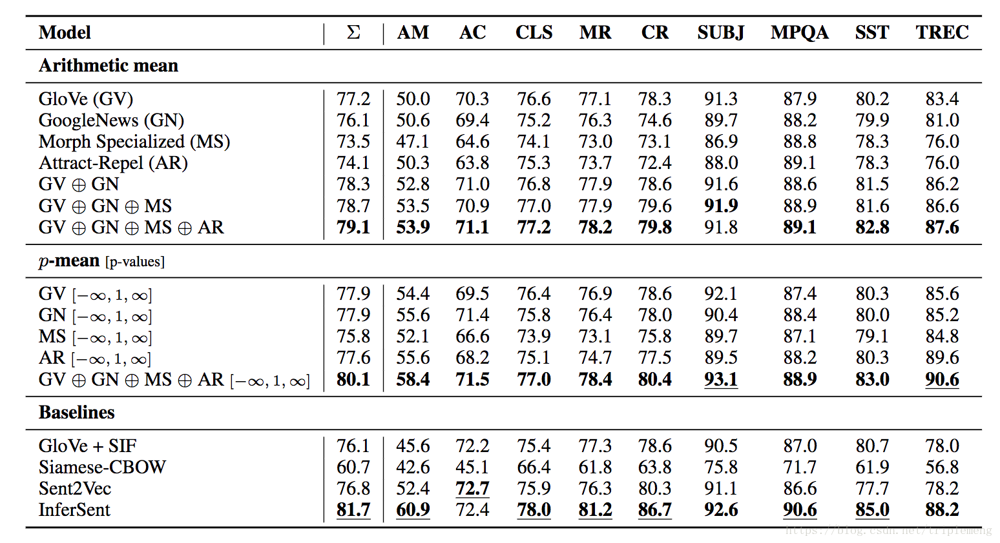

# Concatenated p-mean word embeddings

论文Concatenated Power Mean Embeddings as Universal Cross-Lingual Sentence Representations提出的这种无监督句子编码方法避免了深度学习带来的复杂性, 是一个简单而且足够成熟的 baseline

## 概论
最简单的 BOW 方法就是将所有单词的向量求一个平均作为句子的向量, 但是这种方法一看就是很有问题的, 如果精心设计, 肯定可以找到两个完全意义相反的句子, 其句子编码向量完全一致, 所以这种方法的效果很差, 所以作者在这篇文章中对"求平均"这个操作推广, 使用不同的 p 值产生不同的特征
$$(\frac{x_1^p + ... + x_n^p}{n})^{1/p}\tag{1}$$
当 p 为1的时候, 这就是取平均的方法, 当 p 为正无穷, 就是取最大的方法, 同样的, 负无穷就是取最小. 作者最终的结论是质量不够, 数量来凑, 将以上三张操作放在一起效果很好, 同样的, 一种单词编码方式也不够, 作者引入了 word2vec, glove 等多种词向量数据库, 并把他们全部连接起来

## 实验结果
作者将自己的实验结果和 infernet等泛化能力较强的通用编码器进行了对标, 以寻找那个方法是更好的, 更加有泛化能力的编码方式,

从图中可以看出
- 不同的 embeddings 组合在一起肯定比单个的 embedding 效果好, 这也是所谓质量不行, 数量取胜的规则
- 不同的 p 值引入了更加丰富的信息, 比普通的平均效果更好
- 只有 infernet 的下过略优于本算法, 但是本算法非常简单, 通用性更强

## 总结
### 1. 为何 p-means 连接起来使用?
因为不同的 p 能提供不同的信息, 比如 max 和 min 的引入能限定 embeddings 的取值范围, 减少不确定性
### 2. 为何 p 选择1,正无穷, 负无穷?
偶数 p 损失了符号信息

## 个人思考
简单的模型的叠加不一定就差于我们无法解释的深度学习, 相反, 简单模型由于理解直观, 往往能成块引入重要信息, 这也是机器学习可解释性重要性的所在. 