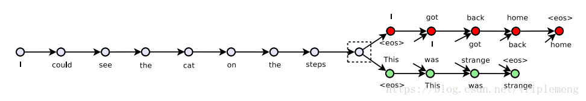
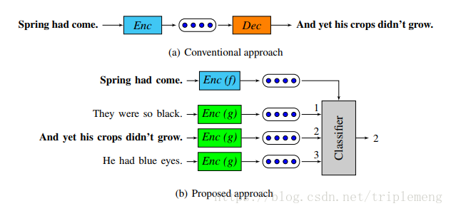

# 从 skip-thoughts 到 quick-thoughts: 句向量中的 skip-gram

<<<<<<< HEAD
quick-thoughts 是一种升级版的 skip-thought, 它借鉴了词向量中 skip-thought 的方法, 可以说是句向量层面的 skip-thought
=======
quick-thoughts是一种升级版的 skip-thought, 它借鉴了词向量中 skip-thought 的方法, 可以说是句向量层面的 skip-thought
>>>>>>> 02ce1ca8e1fcfb6b1e500cc9058aeeb7546c10c4

## skip-thought
要讲qt, 那么离不开他的基础 st, 在 word2vec 算法中, skip-gram 的中心词可以也测 context 窗口中的词汇, 而 st 也是通过中心句预测 context 中的句子

这种预测的实现, 是通过一个 enoder 和一个 decoder 来做的, encoder 来压缩, decoder 来预测, 一般选择 LSTM 或者 GRU, 论文中选择了 GRU, loss function 定义如下:

$$\sum logP(w_{i+1}^t|w_{i+1}^{<t} h_i) + \sum logP(w_{i-1}^t|w_{i-1}^{<t} h_i)$$
本质上, 这里的 decoder 是通过语言模型来实现的

## quick-thought
qt 改进了 deocder 部分的内容, 用一个 classifier 来预测周围的句子, 最大化 softmax 之后上下文预测得到的概率, 两种方法的对比如下:

这里的分类器基于相似度计算, 用到了两个向量的内积形式作为相似度, 最大化这个相似度作为自己的损失函数. 也可以引入 nagtive sampling 的方法. 这样的好处是运行的速度大大提升, 用判别式的方法取代了生成式的方法, 更加接近于 skip-gram, 但是出现时间却晚于 skip-thought

