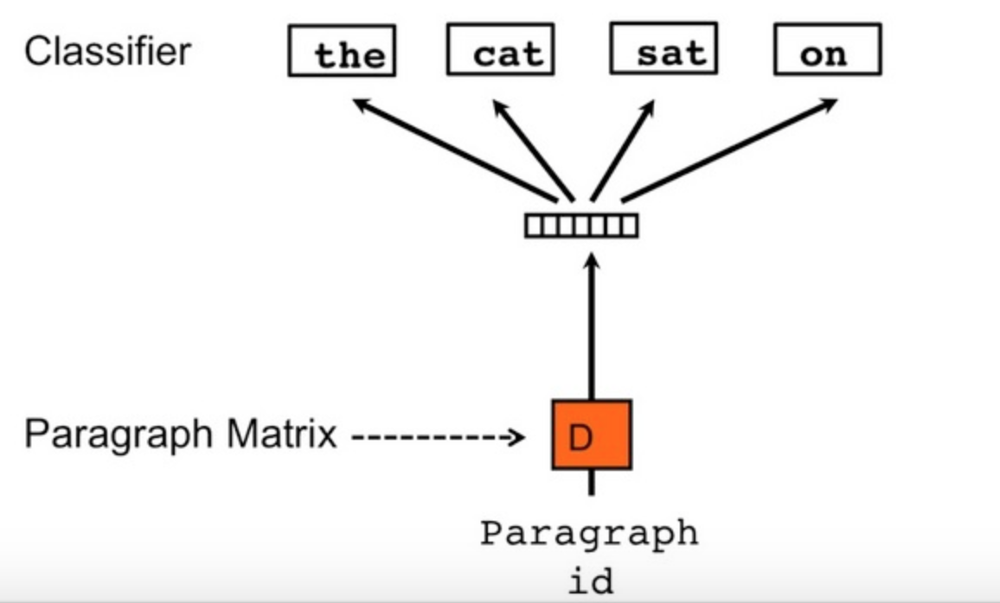

# 对于句子向量研究情况的一些调研
词向量(word embedding)是自然语言的基石, 可以说自然语言处理的快速发展开始于 word embedding 思路的引入, 只要是涉及到深度学习的自然语言处理, 无不涉及到由词向量引申出的句向量甚至段落向量, 文档向量的获取.
在实际生产生活中, 句向量的应用更加广泛, 比如基于索引的问答系统, 问题搜索匹配等等.

## 一些经典的解决方案
### bag of words
这是最最直接的一种方案, 对出现词语建立字典, 忽略语序, 利用count, tfidf, 等方式进行编码, 或者简单求平均, 这是一套非监督的算法, 可迁移性好, 缺点是忽略了语序, 比如not good, not bad分开来之后, 无法分辨到底是怎样的情感态度,因此在一些情感分析的场景下效果不佳
### RNN(LSTM, GRU)
利用 RNN 族的网络对句子进行编码, 在监督任务的场景下端到端对句子进行编码是一种很好的方法, RNN 引入了时序的特征, 在特定任务上表现良好, 但是这是一种监督的算法, 因此迁移性差, 不同的任务需要从头开始训练模型, 同时 LSTM 的小号很大, 而且不能并行计算, 速度很慢
### Sentence2vec
利用了 word2vec 中的思路, 初始化一个句向量, 以这个句子中的词语作为目标, 进行训练, 这是一种非监督的算法, 可以有一定的迁移性, 其效果在 skip-gram 中也有非常有效的证明, 但是训练时间太长了, 而且大多数词语重复,但是关键词差别大的句子, 比如 what is this, how is it going.
    

    
    

### skip-thought vector
同样借鉴了 skip-gram, 通过训练一个 LSTM 编码器, 给句子编码, 通过周围句子向量的相似性学习模型, 和上面 sentence2vec 不同的是, 这种方法是以上下文的向量来训练本句的句向量的.
### 总结
从机器学习的类型上来看, 

| 方法 | 类型 |
|-|-|
bag of words | 无监督
RNN | 监督
paragraph2vec | 无监督
skip-thought | 无监督

## 一些新的研究进展
### SIF
来自论文one simple but tough-to-beat basline for sentence embeddings, 这种方法非常简单, 是 bag of words 的扩展 
方法是这样的, 句子首先表示为词语向量的加权平均, 然后寻找这个向量的主成分(向量在主轴上的投影), 然后向量减去这个主成分就行了
$$v_s = \frac{1}{s}\sum \frac{a}{a+p(w)} \tag{1}$$
$$v_s = vs-uu^Tv_s\tag{2}$$

SIF算是句向量学习深度学习当道的现在的一股清流了, 在实验中, similarity 和 entailment 任务这种方法远远好于 LSTM,DAN,skip-thought 等等,只在 sentiment 任务中弱于 LSTM, 猜测原因是downweight 了诸如 not, good 这样重要的高频词

### InferSent
来自2017非常重要的一篇论文, Supervised Learning of Universal Sentence Representations from Natural Language Inference Data, 也是将迁移学习这一重要的 CV 领域的概念引入到 NLP 的鼻祖, 在之后收到了很多的对比
在 CV 中, 人们通过 ImageNet 这一专门数据集训练通用模型, 然后将基础模型稍加更改, 用在其他的任务上, 那么在 NLP 领域, 是不是也应该有自己的 imageNet 和通用模型呢
作者确定了 SNLI 为 NLP 领域的 ImageNet, 对比不同深度学习模型之后, 确定 bi-LSTM max pooled 为最佳模型, 在之后的文章中将再做记录

### Concatenated p-mean Word Embeddings
这同样是基于 bag of words 方法的一种简单但是有效的句子编码方式, 也体现了机器学习中一个潜规则: 质量不够, 数量来凑. 如果单单对单词编码取平均不能解决问题, 那么就把求平均这个问题 generalize, 把不同的"平均"给 concatenate 起来, 广泛意义上的求平均定义如下:
$$(\frac{x_1^p + ... + x_n^p}{n})^{1/p}\tag{3}$$
p 为正无穷的时候, 得到最大值, p 为负无穷的时候, 得到最小值, 1就是传统取平均, 得到几个平均之后简单串联起来, 送给 lr 模型进行分类, 之后会再介绍这篇文章

### Quick Thoughts
是对于 skip-thoughts 的扩展, skip-thoughts 编码之后需要解码为上下文, 从而训练, 而这种方法直接编码之后再送给一个分类器, 将正确分类的上下文句子可能性最大化(类似skip-gram), 算法效率行高很多

### Universal sentence encoder
基于 Infersent, 也想找一个强大的编码器 baseline, 不同在于文章把 bi-lstm换成了 DAN

### 总结

| 新方法 | 类型 | 基于旧方法 | 贡献
|-|-|-|-|
SIF | 无监督 | BOW | 一个强大的无监督baseline
Infernet | 监督 | ImageNet 迁移学习 | 给出一个通用的编码器和迁移学习的思想
p-mean| 无监督 | BOW | 比 SIF 更加简单有效
Quick-thought | 无监督 | skip-thought | 多通道分类的方法
Universal-sentence-encoder | 监督 | Infersent | 更加简单的通用编码器
